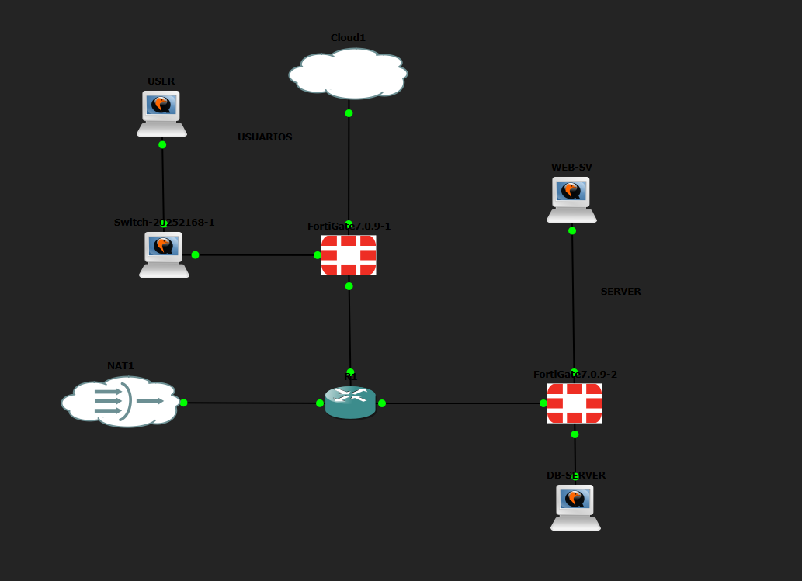
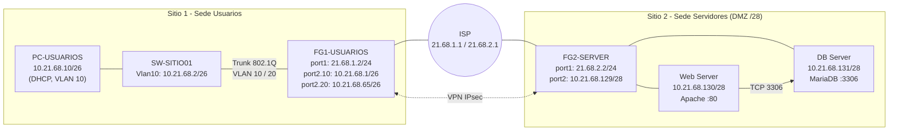
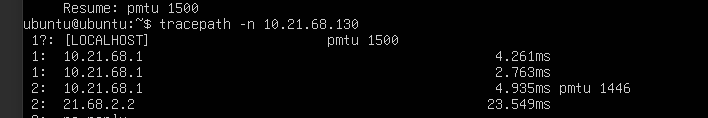

# 1er Parcial – Seguridad de Redes

**Estudiante:** Sebastián  
**Matrícula:** 2168  
**Asignatura:** Seguridad de Redes  
**Video de la demostración:** [Ver video](PEGAR_AQUI_EL_ENLACE_DEL_VIDEO)

---

## 1. Propósito

Implementar una red segmentada de dos sitios (Sede Usuarios y Sede Servidores) protegida por dos FortiGate, aplicando:

- Microsegmentación del Web Server hacia el DB Server y hacia endpoints de actualización (FQDN).
- Acceso remoto seguro (solo SSH por VTY 0 4).
- VLANs con trunk 802.1Q y DHCP para usuarios.
- VPN IPsec site-to-site entre ambos FortiGate.
- Políticas de acceso HTTP de usuarios hacia el Web Server, con registro de denegados.
- Salida a Internet con NAT.

---

## 2. Topología



### Diagrama lógico



---

## 3. Direccionamiento (matrícula 2168)

### Tabla de subredes

| Segmento | Red | Máscara | Rango útil | Gateway | Propósito |
|---|---|---|---|---|---|
| VLAN 10 (Usuarios) | 10.21.68.0/26 | 255.255.255.192 | 10.21.68.1 – 10.21.68.62 | 10.21.68.1 | Clientes con DHCP |
| VLAN 20 (Administrativos) | 10.21.68.64/26 | 255.255.255.192 | 10.21.68.65 – 10.21.68.126 | 10.21.68.65 | Usuarios administrativos |
| DMZ / Servidores (/28) | 10.21.68.128/28 | 255.255.255.240 | 10.21.68.129 – 10.21.68.142 | 10.21.68.129 | Servidores Web y Base de Datos |
| WAN Sitio 1 (FG1 ↔ ISP) | 21.68.1.0/24 | 255.255.255.0 | 21.68.1.1 – 21.68.1.254 | 21.68.1.1 | Enlace WAN sede usuarios |
| WAN Sitio 2 (FG2 ↔ ISP) | 21.68.2.0/24 | 255.255.255.0 | 21.68.2.1 – 21.68.2.254 | 21.68.2.1 | Enlace WAN sede servidores |

### Sitio 1 (Sede Usuarios)

| Dispositivo | Interfaz | Dirección IP | Máscara | Gateway | Rol / Notas |
|---|---|---|---|---|---|
| FG1-USUARIOS | port1 (WAN) | 21.68.1.2 | /24 | 21.68.1.1 | Conexión al ISP / NAT |
| FG1-USUARIOS | port2.10 (VLAN 10) | 10.21.68.1 | /26 | N/A | Gateway usuarios (DHCP Server) |
| FG1-USUARIOS | port2.20 (VLAN 20) | 10.21.68.65 | /26 | N/A | Gateway administrativos |
| SW-SITIO01 | Vlan10 (SVI) | 10.21.68.2 | /26 | 10.21.68.1 | Gestión remota (SSH exclusivo) |
| PC-USUARIOS | eth0 | 10.21.68.10 | /26 | 10.21.68.1 | Asignada por DHCP |

### Sitio 2 (Sede Servidores / Data Center)

| Dispositivo | Interfaz | Dirección IP | Máscara | Gateway | Rol / Notas |
|---|---|---|---|---|---|
| FG2-SERVER | port1 (WAN) | 21.68.2.2 | /24 | 21.68.2.1 | Conexión al ISP / peer VPN |
| FG2-SERVER | port2 (Servidores) | 10.21.68.129 | /28 | N/A | Gateway de la red /28 |
| Web Server | eth0 | 10.21.68.130 | /28 | 10.21.68.129 | Servidor Apache (puerto 80) |
| DB Server | eth0 | 10.21.68.131 | /28 | 10.21.68.129 | Servidor MariaDB (puerto 3306) |

---

## 4. Estructura del repositorio

```
1ER-PARCIAL-SEGURIDAD-DE-REDES/
├── README.md
├── configs/
│   ├── FG1-USUARIOS.txt
│   ├── FG2-SERVER.txt
│   └── SW-SITIO01.txt
└── imagenes/
```

---

## 5. Implementación y evidencias

### Requisito 1 – Repositorio de GitHub

Este repositorio contiene el README con la documentación, los archivos de configuración de cada equipo en `configs/` y las evidencias en `imagenes/`.

---

### Requisito 2 – Microsegmentación del Web Server

El Web Server (10.21.68.130) solo puede iniciar conexiones hacia el DB Server (10.21.68.131) por el puerto **3306** y hacia los endpoints de actualización (objetos FQDN) por HTTP/HTTPS. No hay Internet abierto ni SSH ni ICMP hacia otros destinos.

**Política de microsegmentación:**


**Conexión permitida vía puerto 3306:**


---

### Requisito 3 – Acceso remoto por VTY

Se configuraron únicamente las líneas **VTY 0 4**, con acceso solo por SSH y autenticación con usuario local.


**Acceso remoto por VTY:**


**Solo VTY 0 4 con SSH únicamente:**


**SSH completamente funcional:**


---

### Requisito 4 – Direccionamiento y VLANs

Direccionamiento basado en la matrícula **2168** (ver sección 3):

- VLAN 10 (usuarios, con DHCP): `10.21.68.0/26`
- VLAN 20 (administrativos): `10.21.68.64/26`
- Servidores en red `/28`: `10.21.68.128/28`
- Trunk 802.1Q entre SW-SITIO01 y FG1-USUARIOS
- Hostname configurado en todos los equipos

Las configuraciones completas están en la carpeta [`configs/`](configs/).

---

### Requisito 5 – VPN entre dos FortiGate

VPN IPsec entre FG1-USUARIOS (21.68.1.2) y FG2-SERVER (21.68.2.2). El PC de usuarios llega al Web Server a través de la VPN y la comunicación fluye solo si la VPN está activa.

**Túnel VPN activo:**


**Traceroute al servidor:**



**Pérdida de comunicación al bajar la VPN:**


---

### Requisito 6 – Acceso Usuarios → Web por HTTP

Política que permite a la VLAN 10 acceder al Web Server por HTTP (80). Cualquier otro servicio hacia el Web desde los usuarios queda denegado con registro (log en *Forward Traffic*).

**Acceso permitido:**


**Intento bloqueado de otro servicio:**


---

### Requisito 7 – Servidores

Web Server con **Apache (HTTP)** operativo y DB Server con **MariaDB** escuchando en el puerto **3306**.


---

### Requisito 8 – Salida a Internet

Ruta por defecto y NAT en el FortiGate. El PC de usuarios tiene salida hacia el ISP (`ping` y `traceroute` funcionando).


---

## 6. Archivos de configuración

| Equipo | Archivo |
|---|---|
| FG1-USUARIOS | [configs/FG1-USUARIOS.txt](configs/FG1-USUARIOS.txt) |
| FG2-SERVER | [configs/FG2-SERVER.txt](configs/FG2-SERVER.txt) |
| SW-SITIO01 | [configs/SW-SITIO01.txt](configs/SW-SITIO01.txt) |

---

## 7. Video

[Enlace al video de la demostración](PEGAR_AQUI_EL_ENLACE_DEL_VIDEO)
